- [introduce](#introduce)
- [What is Concurrency?](#WhatIsConcurrency?)
- [Why use concurrency?](#WhyUseConcurrency?)
- [Distinctive concurrency and parallelism?](#DistinctiveConcurrencyAndParallelism?)
- [What is problem concurrency then it's not strong](#WhatsIsProblemConcurrencyThenIt'sNotStrong?)
- [Pattern](#Pattern)
  - [1) Pass chan to function](#1PassChanToFunction)
  - [2) Generator](#2Generator)
  - [3) Fan in](#3FanIn)
  - [4) Restore sequence](#4RestoreSequence)
  - [5) Select timeout](#5SelectTimeout)
  - [6) Quit signal](#6QuitSignal)
  - [7) Daisy chan](#7DaisyChan)
  - [8) Google 1_0](#8Google1_0)
  - [9) Google 2_0](#9Google2_0)
  - [10) Google 2_1](#10Google2_1)
  - [11) Google 3_0](#11Google3_0)
  - [12) Adv ping pong](#12AdvPingPong)
  - [13) Adv subscription](#13AdvSubscription)
  - [14) Context](#14Context)
  - [15) Ring buffer channel](#15RingBufferChannel)
  - [16) Ring buffer](#16RingBuffer)
  - [17) Bug race conditions](#17BugRaceConditions)
  - [18) Bug sleep in loop](#18BugSleepInLoop)
  - [19) Bug lock channel forever](#19BugLockChannelForever)
  - [20) Bug select on nil](#20BugSelectOnNil)
  - [21) Fix bug race conditions](#21FixBugRaceConditions)
  - [22) Fix bug lock channel forever](#22FixBugLockChannelForever)
  - [23) Fix bug sleep in loop](#23FixBugSleepInLoop)
  - [20) Bug select on nil](#20BugSelectOnNil)
  - [20) Bug select on nil](#20BugSelectOnNil)


## Introduce <a name="introduce"></a>
In golang, everything is concurrency, almost : worker of a webserver, worker of a certain process, worker of a certain tool. Concurrency is a built-in mechanism at the language layer of golang. Working with concurrency has never been easy. One thing is a must, you must have a pattern when working with concurrency, experience in using and debugging concurrently. If you don't follow a certain concurrency pattern, everything will mess up, there will be bugs that are unpredictable and difficult to control </br>
I and you dissect the level increment simultaneously, along with the best practices when using it. </br>
Concurrency:  easy to start, but not easy to stop. Here we go!!! </br>

## What is Concurrency? <a name="WhatIsConcurrency"></a>
 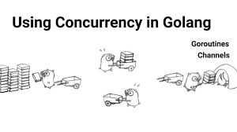 </br>
 Concurrency is the composition of independently executing computations. Concurrency is a way to structure software, particularly as a way to write clean code that interacts well with the real world. In Wikipedia: "concurrency is the ability of different parts or units of a program, algorithm, or problem to be executed out-of-order or in partial order, without affecting the final outcome. </br>
 ==> Summary: There are some problem, we can it executed on many part, maybe is many core or not, ==> summary target : problem run faster but still correct.

Ex: Http WebServer: in one server, we handle many request incoming. To achieve highest for performance, every webserver have solution for concurrency difference. In Golang, summary solution is use routine run worker handle request, there are 3 main way implement: </br>
   1) every routine for every request. </br>
   2) pool routine for all request ( in at time, one routine handle one request) </br>
   3) pool routine with event(Epool, ...) </br>

## Why use concurrency? <a name="WhyUseConcurrency?"></a>
 Concurrency promoting strength in problems: high load, repeating, not much logic interwoven between tasks in one problem. This problems are many times in present: handle request, handle socket, handle message queue, call api, handle big data ... This is reason concurrency is increasingly popular. </br>
 In Golang, concurrency implement in routine, one routine cost is 2 to 8 kb ==> mini cost for concurrency. </br>


## Distinctive concurrency and parallelism?  <a name="DistinctiveConcurrencyAndParallelism?"></a>
 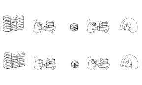 </br>
 For wiki: "Task parallelism (also known as function parallelism and control parallelism) is a form of parallelization of computer code across multiple processors in parallel computing environments. This explanation is not simple for understand it and understand difference with concurrency. There are simple way, follow this case: </br>
    Assume problem run on computer has only one core CPU. You are never way implement parallelism in this context. But you have way implement concurrency in this context. </br>
 ===>    Think about this context, you will understand Distinctive concurrency and parallelism. </br>


## What is problem concurrency then it's not strong ?  <a name="WhatsIsProblemConcurrencyThenIt'sNotStrong?"></a>
  If bottleneck of problems is not dependency concurrency, is dependency for other condition (io, disk,...), have constraint condition in this task concurrency. Ex: you update inventory, you implement one lock for every update. When high load, you can up number concurrency but over range limit of mutex. Have many routine race on mutex, but performance is not greater. routine 1, routine 2, ... routine n wait and race to have mutex. Time and cost for switch context and routine 1, routine 2... is large. In this context, concurrency is slower simple thread run sync( and not use mutex) </br>
==> In this problems, children task run on routine is not run independence, problems is not really for concurrency, it is need other solution. </br>

## Pattern  <a name="Pattern"></a>

todo keep 18 not die 
concurency pattern advance
worker poll best practice
worker poll remote memory

18,19,20 dung cho nhung concurrency phoi hop data chat che và nhieu custom ve luong xu l
workker pool thich hop cho job don gian, khong có qua nhieu custom va quan hẹ data, nó tien cho nguoi dung việc khởi tạo và clear tài nguyên đã được thư viện làm hết rồi


## 1) Pass chan to function  <a name="1PassChanToFunction"></a>
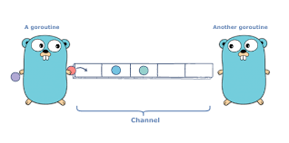 </br>
Example in: https://github.com/Nghiait123456/GolangAdvance/blob/master/ConcurrencyPattern/1_pass_chan_to_function/main.go </br>

Channel is tool sync data from many concurrency. It is strong, popular and flexible. In this example, I simply write to it in the routine and read it in main (maybe in another routine). It's so simple that, you don't need to understand how it syncs data, golang has built and fully integrated a tool syncs feature in the channel. </br>

## 2) Generator  <a name="2Generator"></a>
Example in: https://github.com/Nghiait123456/GolangAdvance/blob/master/ConcurrencyPattern/2_generator/main.go </br>

I have 2 function run on 2 routine, every functions pass data in to one channel. In main, i sequentially get all the data of all those channels. A very simple pattern and has quite a few weaknesses. This weakness will be analyzed in the samples below. </br>


## 3) Fan in  <a name="3FanIn"></a>
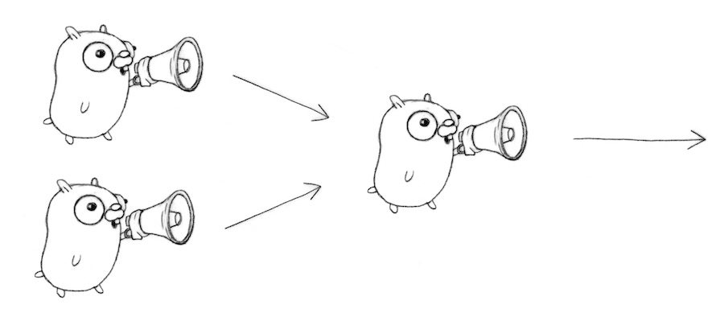 </br>
Example in: https://github.com/Nghiait123456/GolangAdvance/blob/master/ConcurrencyPattern/3_fan_in/main.go </br>

In terms of features, it's the same as Example 2, but I've improved it a bit. A common channel is created to capture data streams from all individual channels. That common channel will be the channel that any place to read will take. </br>
A smart move, you have hundreds of routines and hundreds of channels containing data, you will also only need to care about a single endpoint channel to get the data. The performance bottleneck is almost absent in most backend problems, it usually only appears in some very deep performance problems in the OS kernel. </br>
A simple, powerful and commonly used pattern. </br>


## 4) Restore sequence  <a name="4RestoreSequence"></a>
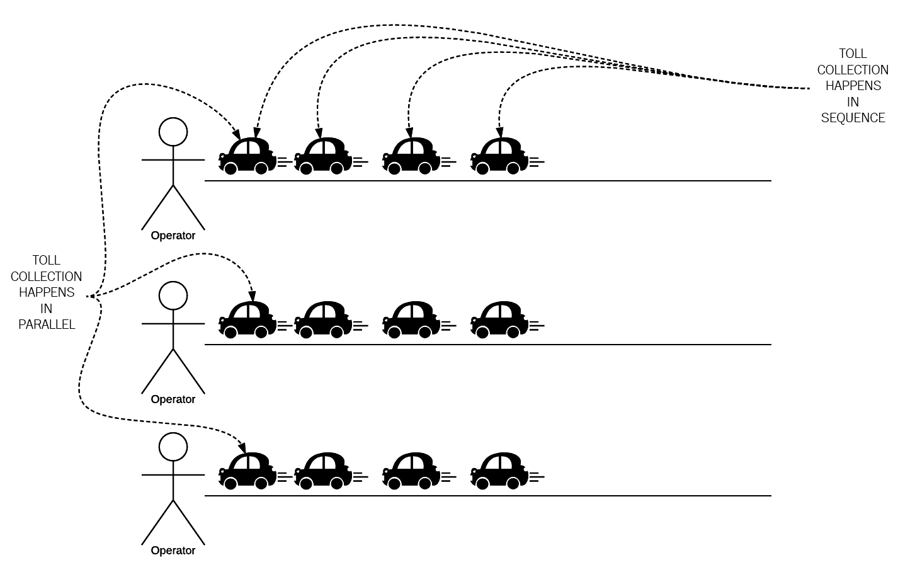 </br>

Example in: https://github.com/Nghiait123456/GolangAdvance/blob/master/ConcurrencyPattern/4_restore_sequence/main.go </br>

In patter 3) Fan in, consummer and producer continuously run and retrieve data, ignoring order of data retrieval and interaction. Now, I want when a consummer pushes 1 data, the producer has to process it, then let allow the consummer do the work and push the data continue. The idea: each stream will have an endpoint to coordinate, block, and allow to work. Fortunately, the channel already has that feature. </br>

Each routine will create a waitForIt channel, after writing data, worker loops at "<- waitForIt" until it is allowed to work in "msg.wait <- true //". </br>

In golang, synchronous and asynchronous handling becomes simple with channels. In languages ​​where there is no direct concurrency build in that language, using an external packet, this is often more complicated and not very performant. </br>


## 5) Select timeout  <a name="5SelectTimeout"></a>
Example in: https://github.com/Nghiait123456/GolangAdvance/blob/master/ConcurrencyPattern/5_select_timeout/main.go </br>

I have many routine and many channel data for one job, and we want to set timeout for it. Idea: there must be a loop that checks that and a timeout signal </br>

In golang, there are two concurrency structures: </br>
1) event loop for multiple events: </br>
```
for {
    select {
    case s := <-c:
        fmt.Println(s)
    case <-timeout:
        fmt.Println("You talk too much.")
        return
    }
}
```
 </br>

2) channel for detail event: ```case <-timeout:``` </br>

I use structure 1 for looping, and structure 2 for signal processing (with data, timeout). Everything works fine until the event timeout is caught. I insert my timeout handler and it's over. </br>


## 6) Quit signal <a name="6QuitSignal"></a>
Example in: https://github.com/Nghiait123456/GolangAdvance/blob/master/ConcurrencyPattern/6_quit_signal/main.go </br>

Quite similar to the idea of pattern 5, I want to quit my job when I want. I implement a quit channel, catch the signal and process on it. </br>


## 7) Daisy chan <a name="7DaisyChan"></a>
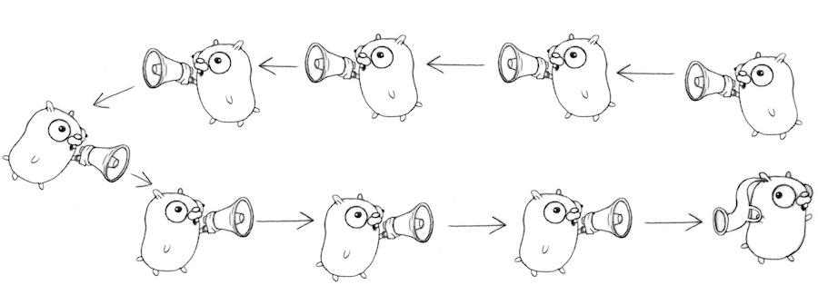 </br>
Example in: https://github.com/Nghiait123456/GolangAdvance/blob/master/ConcurrencyPattern/7_daisy_chan/main.go

This pattern demonstrates that it is possible to create a large number of go routines, and it makes clear the block of channel property. </br>
This is Rob Pike's pattern and I tried to rewrite it in a way that is easier to understand for newbies.I made 10000 chanel loops that block each other: </br>
left <- (new) right (now left) <- (new) right (now left) <- ... </br>
channel 1 <- channel 2 <-.... <- chanel 10000 </br>
This block only ends when channel 100000 is written, and all channels and routines containing it are released. Run the code and you'll see I've printed this in detail. </br>

In Rob Pike's original example, there is another pretty easy explanation, you can refer to: https://stackoverflow.com/questions/26135616/understand-the-code-go-concurrency-pattern-daisy-chain </br>


## 8) Google 1_0 <a name="8Google1_0"></a>
Example in: https://github.com/Nghiait123456/GolangAdvance/blob/master/ConcurrencyPattern/8_google1_0/main.go

I query 3 service and merge result. This is a common job in microservices. All are conducted sequentially and the time to complete the entire job is equal to the total time to complete all the subtasks.


## 9) Google 2_0 <a name="9Google2_0"></a>
Example in: https://github.com/Nghiait123456/GolangAdvance/blob/master/ConcurrencyPattern/9_google2_0/main.go </br>

Similar to pattern 8 but here, with a little runtime improvement. Job query search all run concurrency. The result is merged into 1 channel. The running time is approximately 1/3 of pattern 8. </br>

## 10) Google 2_1 <a name="10Google2_1"></a>
Example in: https://github.com/Nghiait123456/GolangAdvance/blob/master/ConcurrencyPattern/10_google2_1/main.go </br>

Same as pattern 9 but I want a timeout for all jobs. The syntax mentioned in the previous examples is reused: </br>
```
for i := 0; i < 3; i++ {
    select {
    case r := <-c:
        results = append(results, r)
        // this line ignore the slow server.
    case <-timeout:
        fmt.Println("timeout")
        return results
    }
}
```

Everything works until there is a timeout and the process ends. <br>


## 11) Google 3_0 <a name="11Google3_0"></a>

Example in: https://github.com/Nghiait123456/GolangAdvance/blob/master/ConcurrencyPattern/11_google3_0/main.go </br>

I have many search jobs: photo, video, audio,... Each of those jobs, I have multiple endpoints to get results, I want to get results back from the earliest responding endpoint. The idea: The results are concentrated in one channel and the earliest data pushed into it is considered the earliest response data. </br>

```
func First(query string, replicas ...Search) Result {
    c := make(chan Result)
    for i := range replicas {
        go func(idx int) {
        c <- replicas[idx](query)
        }(i)
    }
    // the magic is here. First function always waits for 1 time after receiving the result
    return <-c
}
```

Here, there are many routines that push data to channel c, the first data will be recorded as the earliest. </br>

## 12) Adv ping pong <a name="12AdvPingPong"></a>
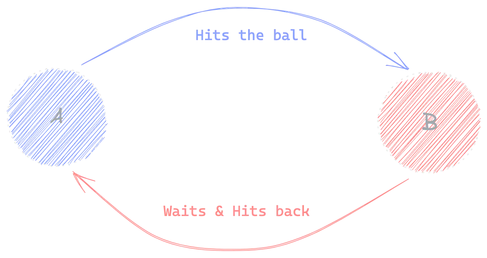
Example in: https://github.com/Nghiait123456/GolangAdvance/blob/master/ConcurrencyPattern/12_adv_pingpong/main.go </br>

A sequential scheduling mechanism for 2 routines with 1 channel. Imagine there are two table tennis players named Ping and Pong. The referee throws the ball to Ping, Ping takes it and pushes the ball to Pong. Before the ball was sent to Pong, Pong waited and relaxed. When the ball comes to him, Pong handles and throws back Ping (while Pong handles, Ping also waits and relaxes). That loop will repeat until the referee stops the game. </br>

The idea here is: use a single channel and the blocked mechanism of the channel is to sync 2 routines. </br>


## 13) Adv subscription <a name="13AdvSubscription"></a>
Example in: https://github.com/Nghiait123456/GolangAdvance/blob/master/ConcurrencyPattern/13_adv_subscription/main.go </br>

I want to be more professional for fetch, an automatic getData, filter and merger, timeout and quit job. It is still based on the structure of : </br>
```
for {
select {
         case :
         }
}
```

```
merged := Merge(
    Subscribe(Fetch("blog.golang.org")),
    Subscribe(Fetch("googleblog.blogspot.com")),
    Subscribe(Fetch("googledevelopers.blogspot.com")),
)
```
Fetch() does the sole job of fetching data, Subcribe() creates a loop, controls the loop one stream fetch and merge data, quit stream. Merger() controls Subcribes, controls all Subcribes() for different loop streams. </br>


## 14) Context  <a name="14Context"></a>
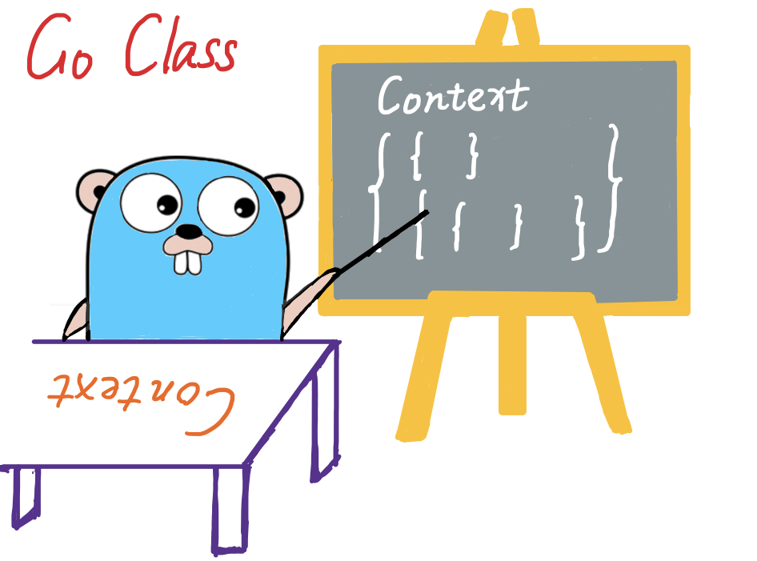

Example in: https://github.com/Nghiait123456/GolangAdvance/tree/master/ConcurrencyPattern/14_context </br>

In golang, everything is pretty much concurrency, and each of those threads always needs a set of its context. This context set is unique to it, it provides basic information: how long have I been running, what schedules or appointments do I have, what specific data do I contain... Imagine , it's like a container but a bit specific, this container contains the state of the running go routines. </br>

Team golang has developed a packet base: context. It serves the problems given above, and it is the base of extended contexts in other tools. Most web frameworks, auto tools,... are based on it and develop their own context. Context is an integral part of most tool bases on golang. </br>


View source: https://github.com/golang/go/blob/master/src/context/context.go The Context develops completely based on the patterns I showed before, however, it has some dark superior in syncs performance. Its basic principles remain the same, it has been quite clearly outlined in the previous patterns. In this section, I will not dissect it in detail, it is presented in another document. </br>

## 15) Ring buffer channel  <a name="15RingBufferChannel"></a>
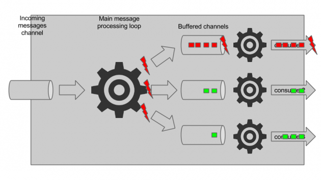
Example in: https://github.com/Nghiait123456/GolangAdvance/tree/master/ConcurrencyPattern/15_ring_buffer_channel </br>

A meridian syncs data structure is the ringbuffer. This is probably the fastest pattern available today. I want to use its properties applied to the channel with the ring buffer channel. It won't have the same performance as ringbuffer but it has full pattern composition, read/write separation, etc. Again, it's not faster than a normal channel (because it's based on a channel), it's not as fast either ring (for not following the rules of ring). </br>

In the original post: https://tanzu.vmware.com/content/blog/a-channel-based-ring-buffer-in-go, the author develops a ring buffer with a limit out stream mechanism. The idea is simple: Connect two buffered channels through one goroutine that forwards messages from the incoming channel to the outgoing channel. Whenever a new message can not be placed on the outgoing channel, take one message out of the outgoing channel (that is the oldest message in the buffer), drop it, and place the new message in the newly freed up outgoing channel </br>

With the ring-buffer channel having no limit, I simply skip taking the element when the limit is and declare the channel to have no limit. </br>

Both of these patterns are implemented in the example link. </br>


## 16) Ring buffer <a name="16RingBuffer"></a>
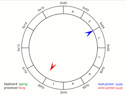
Example in: https://github.com/Nghiait123456/GolangAdvance/tree/master/ConcurrencyPattern/15_ring_buffer_channel </br>

I'm trying to implement the simplest and most basic full-featured ring buffer. The essence of why ring buffer is fast: </br>
1) exclusive separation </br>
2) use os-level quick command to handle race condition </br>

Specifically, I try to implement syncs on the atomic package. Package atomic provides low-level atomic memory primitives useful for implementing( synchronization algorithms.atomic.AddUint64(), atomic.Store(), atomic.CompareAndSwap(), .... ). There are quite a few implementations of the ring buffer, either in the same language or in different languages. In addition to complying with the design ring buffer, you need to use the fastest atomic syncs package and the most atomic low level compliant. Specifically, it needs to comply: https://en.wikipedia.org/wiki/Compare-and-swap </br>

On my laptop, my package can handle 30 M read and write commands per second with 2000 routines. It is about 8 times faster than channels in the same environment. </br>


## 17) Bug race conditions <a name="17BugRaceConditions"></a>
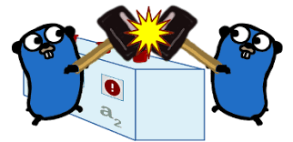
Example in: https://github.com/Nghiait123456/GolangAdvance/blob/master/ConcurrencyPattern/17_bug_race_conditions/main.go  </br>

Like I said, in golang, almost everything is concurrency. So with shared data, race conditons always exist. Race conditons are one of the most difficult bugs to debug and detect. It can produce errors that are difficult to detect and do not occur in bulk. When the threshold of race conditions is so large that a collision occurs, it will generate an error, and when the error is severe enough to manifest, then the error will be displayed. </br>

Thankfully there are rules and tools to fix most of this problem. First, golang develops the --race option for debugging. "go run --race main.go" : it helps in early detection of race conditons.

A simple programming rule to remember to minimize bug race conditions. With shared data, always use the syncs mechanism, can be any mechanism but always syncs the data. In golang there are: muxtex, channel, atomic, ring buffer, ... The most popular and used is chan. </br>


## 18) Bug sleep in loop <a name="18BugSleepInLoop"></a>
Example in: https://github.com/Nghiait123456/GolangAdvance/blob/master/ConcurrencyPattern/18_bug_sleep_in_loop/main.go </br>

```
func (s *naiveSub) loop() {
	// STARTNAIVE OMIT
	for {
		if s.closed { // HLsync
			close(s.updates)
			return
		}
		items, next, err := s.fetcher.Fetch()
		if err != nil {
			s.err = err                  // HLsync
			time.Sleep(10 * time.Second) // HLsleep
			continue
		}
		for _, item := range items {
			s.updates <- item // HLsend
		}
		if now := time.Now(); next.After(now) {
			time.Sleep(next.Sub(now)) // HLsleep
		}
	}
	// STOPNAIVE OMIT
}
```
Have two times use time.Sleep() in one in loop. This code uses time.Sleep() for timing. When falling into case time sleep, the system will lose realtime, all even during time.Sleep() will not be caught. Use Sleep() only when you are sure there are no events to catch during sleep. Otherwise, the system is not trusted enough, you may lose data </br>


## 19) Bug lock channel forever <a name="19BugLockChannelForever"></a>
Example in: https://github.com/Nghiait123456/GolangAdvance/blob/master/ConcurrencyPattern/19_bug_block_channel_forever/main.go  </br>

```
func (s *naiveSub) loop() {
	// STARTNAIVE OMIT
	for {
		if s.closed { // HLsync
			close(s.updates)
			return
		}
		items, next, err := s.fetcher.Fetch()
		if err != nil {
			s.err = err                  // HLsync
			time.Sleep(10 * time.Second) // HLsleep
			continue
		}
		for _, item := range items {
			s.updates <- item // HLsend
		}
		if now := time.Now(); next.After(now) {
			time.Sleep(next.Sub(now)) // HLsleep
		}
	}
	// STOPNAIVE OMIT
}
```
Print "s.updates <- item // HLsend", if there is no read <-s.updates anywhere, the s.Update channel will be suspended until there is room to read it. This can be used as a mechanism to lock and wait for the routine, or if it's unintentional, it's an error. </br>


## 20) Bug select on nil <a name="20BugSelectOnNil"></a>
Example in: https://github.com/Nghiait123456/GolangAdvance/blob/master/ConcurrencyPattern/20_bug_channel_selecter_on_nil/main.go  </br>

```
	go func() {
		a = nil // HL
		fmt.Println("start push to nil chan")
		a <- "ssss"
		fmt.Println("done push to nil chan")
	}()

	go func() {
		a = nil // HL
		fmt.Println("get from nil channel")
		<-a
		fmt.Println("done get from nil channel")
	}()
```
```
for {
			select {
			case s := <-a:
				fmt.Println("have data in nil chan")
				fmt.Println("got", s)
			case s := <-b:
				fmt.Println("got", s)
			}
		}
```
A channel is set to nil, reading and writing on it will be blocked </br>


## 21) Fix bug race conditions <a name="21FixBugRaceConditions"></a>
Example in: https://github.com/Nghiait123456/GolangAdvance/blob/master/ConcurrencyPattern/20_bug_channel_selecter_on_nil/main.go  </br>

```
	case errc := <-s.closing: // HLcases
			errc <- err
			close(s.updates)
			return
```
The idea is to use some kind of synchronization mechanism. Here, I use the most common way of using chan. </br>


## 22) Fix bug lock channel forever <a name="22FixBugLockChannelForever"></a>
Example in: https://github.com/Nghiait123456/GolangAdvance/blob/master/ConcurrencyPattern/22_fix_bug_block_channel_forever/main.go </br>

```
	case updates <- first:
			fmt.Println("----------------------------------push first to update")
			pending = pending[1:]
```
```
	if len(pending) > 0 {
			fmt.Println("--------------------------------------------len pending >0, pop first element")
			first = pending[0]
			updates = s.updates // enable send case
		}

```
```
			for _, item := range fetched {
				if id := item.GUID; !seen[id] { // HLdupe
					fmt.Println("----------------------------------------------foreach add data to pending")
					pending = append(pending, item)
					seen[id] = true // HLduped
				}
			}
```
In this pattern, Google has created a pending buffer, when len(pending) > 0, enable channel update, "updates = s.updates // enable send case", data will be sequentially pushed to the s.updates channel through an intermediary. first. Personally, this pattern is a bit complicated to use, I will suggest a simpler pattern to replace it below. </br>

[23) Fix bug sleep in loop](#23FixBugSleepInLoop)