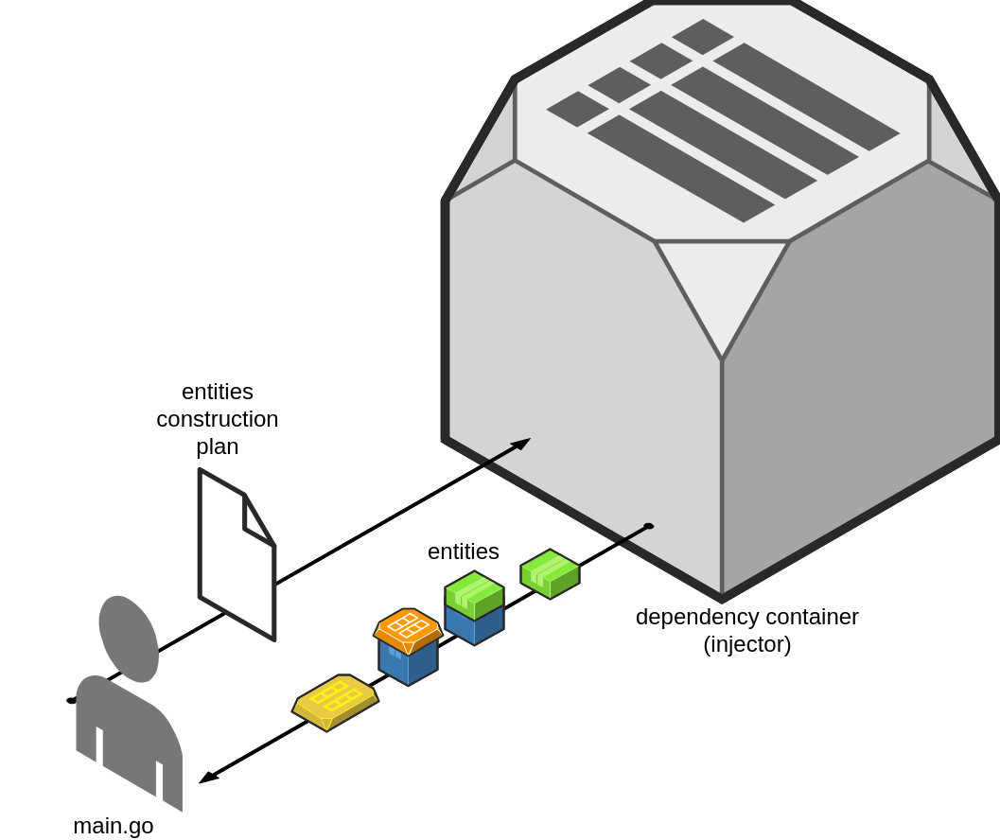

- [Preview](#preview)
- [Type of DI](#type_of_di)
- [When use DI](#when_use_di)
- [Best practice](#best_practice)

## Preview 

Go is a statically typed, compiled programming language designed at Google by Robert Griesemer, Rob Pike, and Ken
Thompson. Go is a fast, lightweight, syntactically simple language that takes full advantage of the power of routines
and concurrency. In particular, golang does not have a Dependency Injector. The use of DI in golang was still a
controversial topic up until the time I wrote this doc.  

Rob Pike has a strong focus on simplicity and efficiency, and go defaults to no DI. In opensource packets, most do not
use DI. Only in projects with a large amount of code and deep logic is DI used. However, I want to reiterate, DI is not
very popular and favored in the golang world.  

## Type of DI 

There are 2 main types of DI in go:  

1) DI with instantiating all necessary instances in a service container and retrieving it for use when needed.  
     
   A good example: https://github.com/uber-go/dig. This DI way is convenient for users, simply, the weakness is the
   decrease in golang performance due to the processing of DI when running, and the user must know more rules of that DI
   packet to understand the go code.

2) DI without any containers needing to be instantiated. All DI code will be generated into the corresponding .go file.
   The entire logic of the service will be the logic of the golang code, no magic will exist here. Strengths: Unaffected
   speed, simple, intuitive. Weaknesses: need more complex DI config. A typical
   packet: https://github.com/google/wire.  

In this document, I focus on practical, real-world and best-practice experiences with DI in section 2).  

## When use DI 

When you need DI:  

1) Make sure your code is rich and deep enough, manual DI is repetitive and expensive, and using automated DI will save
   that cost.  
2) After using DI, the code will be easier to maintain, the code development time will be faster, not using DI to create
   a complex project. Remember, DI was made to solve the hard work of manual DI, it wasn't made to complicate
   code.  
3) All team members have a basic understanding and are comfortable using a DI tool  

## Best practice 

In this document, I focus on talking about best practice when using DI with the second type of DI, DI by code
generation.  
My two examples of
this: https://github.com/Nghiait123456/HighPerformancePaymentGateway-BalanceService, https://github.com/Nghiait123456/BestPraciteDIWireGolang,  

The rule here is: Golang is a non-DI language and most of go's packets don't use DI. Not that it's natural, the code of
those packets is very clean and reusable. So I assert, if you use 100% DI in project, your go code will be quite
complicated and over enginnering. Some key principles:  

1) Automated DI only with packets or common code with lots of params and reuse, high custom params.  
2) Do not DI automatically with packets that do not need to pass param, or the param is difficult to change. Take a look
   at the open source of golang's packets. Do manual DI like them, it's simple and effective with go.  
3) Practice fluently 1,2, only use 1 when you really need 1 to solve the problem, don't abuse 1.  
