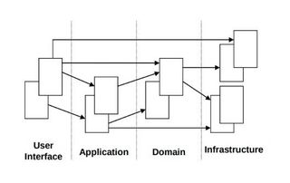
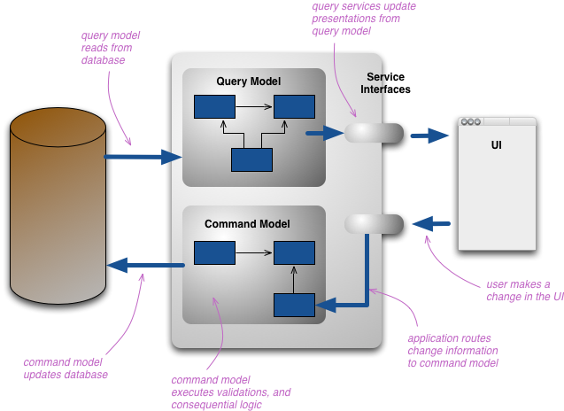
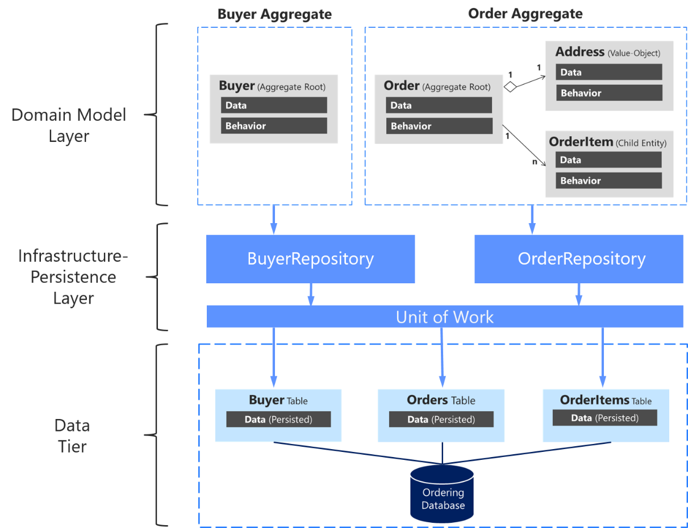
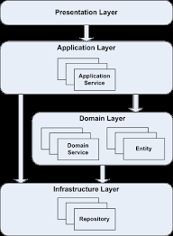
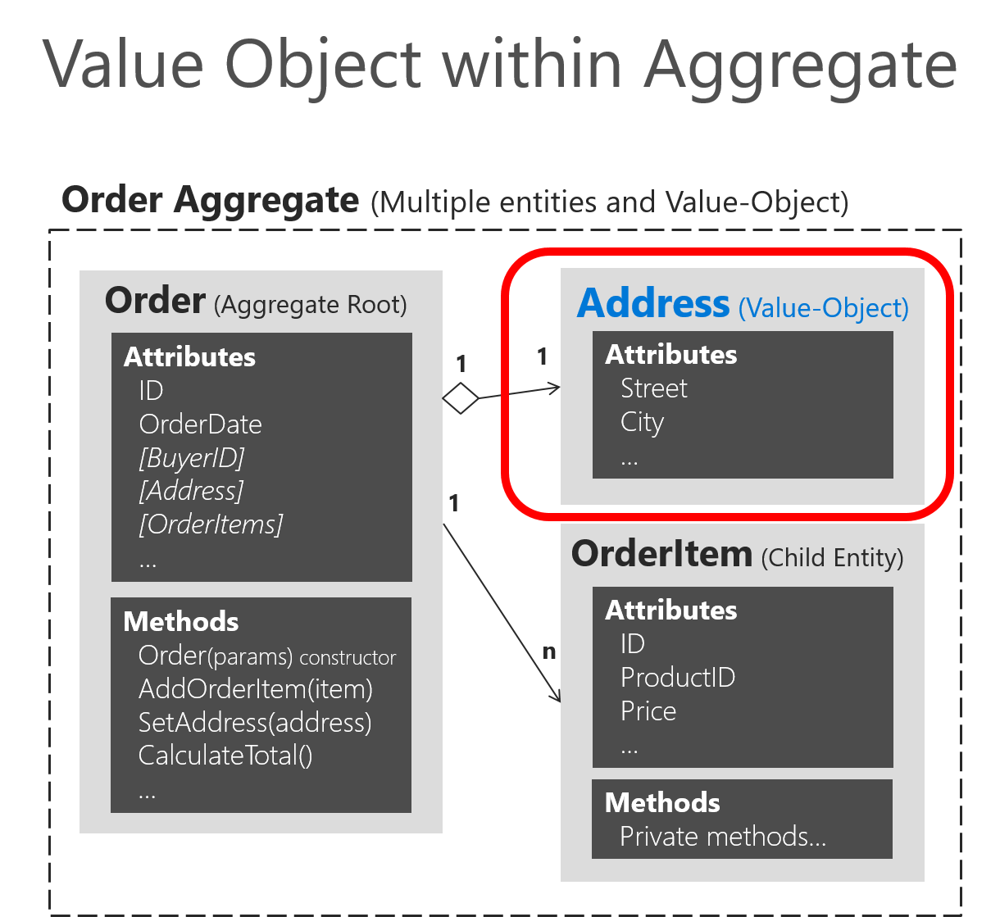
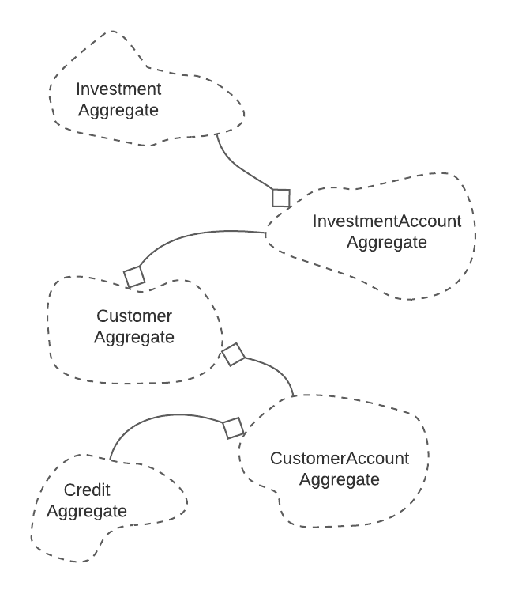

- [Introduce](#Introduce)
- [Source](#Source)
- [Directories](#Directories)
  - [Layout](#Layout)
  - [Domain](#Domain)
  - [Entity](#Enity)
  - [Infrastructure](#Infrastructure)
  - [User Interface](#UserInterface)
  - [Packet layer](#PacketLayer)
  - [Application](#Application)
  - [Value Object](#ValueObject)
  - [Aggregate](#Aggregate)

    

## Introduce 
In 2003, Eric Evans introduced domain driven design, it quickly resonated and was gradually used for large projects. Domain-driven design (DDD) is a major software design approach,focusing on modeling software to match a domain according to input from that domain's experts. Popular books on it include: Eric Evans 2003 - Domain-Driven Design, Domain Driven Design Quickly, ...This design method is very broad, multi-problem, and a fact that no one can express its core problem better than the author. In this document, I do not focus on theory, I focus on practice with this theory. Specifically, I built a domain driven design framework with golang, it is flexible, flexible and applicable to all go frameworks. It can be used for both monolithic as well as micro service. Hope it helps you, enjoy and relax it.  

## Source 
This source template is: https://github.com/Nghiait123456/HighPerformancePaymentGateway-BalanceService  

## Directories 
## Layout 
  
This is the most comprehensive and visual diagram of ddd. However, for newbies, it is not easily accessible. I give the most general layout and dissect each section with examples with real code.  

## Domain 
1) /balance/domain: https://github.com/Nghiait123456/HighPerformancePaymentGateway-BalanceService/tree/master/balance/domain  
  
All domain of the project will be saved here. I implement a CQRS pattern, the domain logic will split into 2 patterns:  
1.1. /balance/domain/command : the code that changes the data of the system. Please view: https://github.com/Nghiait123456/HighPerformancePaymentGateway-BalanceService/tree/master/balance/domain/command  
1.2. /balance/domain/query : the code that serves to read data, not directly change the system data. Please view: https://github.com/Nghiait123456/HighPerformancePaymentGateway-BalanceService/tree/master/balance/domain/query  

To create a reasonable domain, domain creators and splitters must understand that domain like a domain expert. A common problem, domain experts often do not know about programming and computers, and programmers do not know about the domain they are working on. By any means of learning and learning, domain creators must understand that domain, must find a common language to communicate between domain experts. With complex domains, this is not an easy job. In my experience, domain understanding should follow a topdown layout, going from the most general descriptions to the specific ones. This is not easy because the person doing this must understand both domain and tech to act as a bridge between customers and devs.  

## Entity 
/balance/entity: please view: https://github.com/Nghiait123456/HighPerformancePaymentGateway-BalanceService/tree/master/balance/entity  
Objects are a common concept in programming. When coding, you're almost always coding for an object, and it's a broad concept. There is an object type, it is specifically identified, it is the same in different environments and services, as long as the ID is the same, it must be the same. It is unique with an identifier ID. That is the concept of entity.  
Eg: A person identifier with cmt number, a bank account, a land red book, a province, etc. The above examples have a lot of information but it is an entity, and it is unique.  
An entity will be instantiated and used for many services, it is unique so there must be no difference in properties between services or modules. This is an important property of the entity.  

## Infrastructure 
  
Infrastructure is all code directly related to infrastructure. Infrastructure has a lot of things: cache, files, CDN, DB, message queue, http server, socket, rtmp,... In ddd, all the code or libraries that manipulate and setup directly with the infrastructure should be stored in the infrastructure layout </ br>
There is a classic question that gets many opinions: Should repositories be saved in the domain layout or the infrastructure layout. For me, I want to keep the domain as minimal logic that domain has, so I usually put the repository and infrastructure. (A good discussion: https://stackoverflow.com/questions/3499119/which-layer-should-repositories-go-in, https://learn.microsoft.com/en-us/dotnet/architecture/microservices /microservice-ddd-cqrs-patterns/infrastructure-persistence-layer-design).  

## User Interface 
Please view: https://github.com/Nghiait123456/HighPerformancePaymentGateway-BalanceService/tree/master/balance/interfaces  
It is the starting and ending point of every interaction with the user. All api define, features, interactions will be done in the layout interface.  

## Packet layer 
Please view: https://github.com/Nghiait123456/HighPerformancePaymentGateway-BalanceService/tree/master/balance/pkg  
One directory that is not included in ddd but is widely accepted and used by the golang community is pkg. Normally, pkg/external: contains code that can be used in the project and other projects of other services, internal will contain only that servcie's code, if the project does not have external, only pkg will be needed. (link: https://github.com/golang-standards/project-layout/tree/master/pkg, https://travisjeffery.com/b/2019/11/i-ll-take-pkg-over-internal/).  
In this design, pkg will synthesize all the code logic that is not in a specific layout of ddd, eg: common auth, o-auth, common validate, common video parser, ... It should be put in packet and will be called by higher layouts such as domain, application, interface, ... when used.  

## Application 
  
Please view: https://github.com/Nghiait123456/HighPerformancePaymentGateway-BalanceService/tree/master/balance/application  
Application is a thin layer that is intermediate between the user interface and the domain. Domain layout is the soul of ddd, domain needs to be kept independent logic, not much influenced by layout user interface as well as other layout. Application is a lightweight class, intermediate between interfaces and domains, to accomplish this purpose. Specifically, Application will perform most of the connection functions between interface and domain, return object of domain, convert result from domain to JSON, XML is also often implemented in this layout.  

## Value Object 
  
Please view: https://github.com/Nghiait123456/HighPerformancePaymentGateway-BalanceService/tree/master/balance/value_object  
A Value object is an unidentified, immutable object that is created and used during its lifetime and can be shared for reading. For a different value, create a new object. A tip to distinguish, a smallest object, when it is not an entity, it will usually be a value object.  
A large value object will be associated with a lot of development code, in golang, a function will be associated with that code. I keep value objects like that in the layout domain. Please view: https://github.com/Nghiait123456/HighPerformancePaymentGateway-BalanceService/blob/master/balance/domain/command/calculator/init_all_partner_balance.go#L18-L25, https://github.com/i-love-flamingo /flamingo-commerce/blob/master/cart/domain/cart/cart.go#L18-L87. This is a peculiarity of golang, the large value object goes hand in hand with interface and function, and I have kept it in this design  

## Aggregate 
  

Entities and objects in the project have complex relationships, there are many interactions and operations on them to give a composite result. Naturally, I needed to group closely related value objetcs and entities into a cluster for easy development. This is the premise of Aggregate.  

An aggregate is a group of objects, which has can be viewed as a unified unit for data changes. Each aggregate usually has a root, that root is entity. An aggregate root will interact with objects in the aggregate, and objects outside of the aggregate will interact only with the aggregate root. There are very few cases where there are multiple enities in an aggregate, if so, there will always be a single agggragate root that interacts with the object outside the aggragate.  

The root aggregate is a bridge for interaction between the outside and the inside of the aggreagate. All read, write, and process interactions will go through the root aggregate. This is the most important rule for an aggregate to ensure data integrity. If as aggregate of Aggregate was Save in Database, only direct queries should be allowed to retrieve the origin of the aggregate, the contents of the object should be accessed through relationships inside.  

Choosing the boundary for aggragate is not an easy job, requires a lot of experience and domain knowledge. Aggragate itself is not a clear definition like entity or value object, choosing the right aggragate greatly affects the maintainability of ddd. In this design, I put the aggragate in the layout domain. Example: https://github.com/percybolmer/ddd-go/blob/master/aggregate/customer.go#L18-L26, https://levelup.gitconnected.com/practical-ddd-in-golang-aggregate- de13f561e629.  

